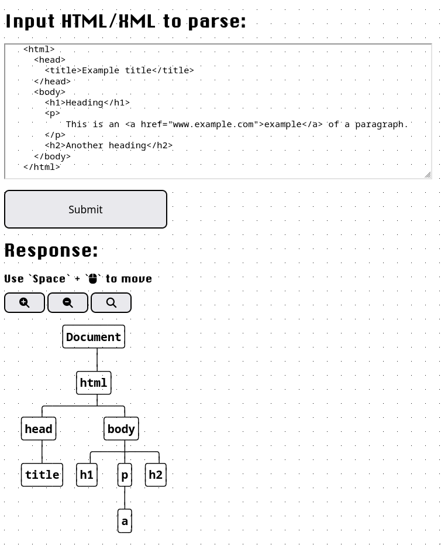

# DOM Visualizer

A simple website with a backend golang parser of any XML-like text.

This site was made because of a lack of good Document Object Model visualizers and is intended for those learning webdev or those that want to better understand how a certain website is structured. I used this all the time and decided to make it public for everyone because... why not? Hopefully you find it usefull too!



The output is a tree in plain (unicode) text.

## Prerequisites

- [Go](https://go.dev).

## Installation

To get started with this project, clone the repository and run (or compile, then run) using the `go` command.

```bash
git clone https://github.com/ikugox/DOM-Visualizer.git
cd DOM-Visualizer
go run ./main.go
```
or
```bash
go build
./dom-visualizer
```
to compile it first.

## Usage

The default port is on **8080**, but that can be changed in the `main.go` file.

Simply paste the code you want to see in the text box and press submit.

You can then use the zoom keys along with a spacebar to drag the output around the screen.
